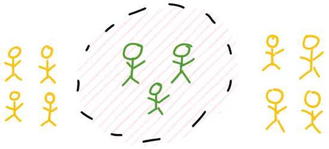

### Fishbowl

#### Context
There is a need for a discussion or debate within the group.

#### Description
"Four to five chairs are arranged in an inner circle. This is the fishbowl. The remaining chairs are arranged in concentric circles outside the fishbowl. A few participants are selected to fill the fishbowl, while the rest of the group sit on the chairs outside the fishbowl. In an open fishbowl, one chair is left empty. In a closed fishbowl, all chairs are filled. The moderator introduces the topic and the participants start discussing the topic. The audience outside the fishbowl listen in on the discussion." [[1]](http://en.wikipedia.org/wiki/Fishbowl_%28conversation%29)

Also, ideally, the facilitator should take notes and post them after session is over. The fish bowl pattern is best used when it’s not practical to have a regular discussion, e.g. the group is too big for it to be practical.

#### Preparation
It’s good if the facilitator of the fish bowl prepares a few questions and directions for the session.

#### Pros
Good for "hot topic" discussions. In a fishbowl, talking space gets coupled to physical space, so the amount of talking is usually more even distributed than otherwise. It’s overall good for individuals to practice/analyze rhetorics and also to listen to the rest of the group.

#### Cons
If there is an official or unofficial leader of the group, people tend to value his/her opinions more than someone else’s and that’s not good for exploring the groups different opinions.