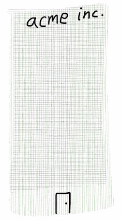

### Real World Problem

#### Context
A member of the group has a problem in their project and think that the problem would be interesting for the group to explore

#### Description
Sharing real world problems can be very valuable - for both parties: for the person having the problem, he/she needs to tell the group about it in a clear way (see [rubber duck](http://en.wikipedia.org/wiki/Rubber_duck_debugging)[ debugging](http://en.wikipedia.org/wiki/Rubber_duck_debugging)) and the group gets to know about what kind of problems that we encounter. The problem picture is shared and then a discussion follow. It’s good to have a whiteboard in the room, especially for architecture/tech related problems.

#### Preparation
Write down your problem. Find a room with a whiteboard.

#### Pros
The group gets knowledge about real world problems. Hopefully, the session leader gets some further directions to pursuit in the problem. Being able to un-package a problem, both individually and collectively is an important skill.

#### Cons
Risk that the problem is not interesting enough for the rest of the group.